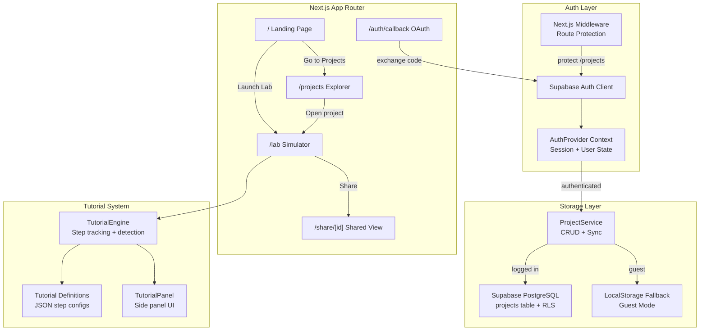
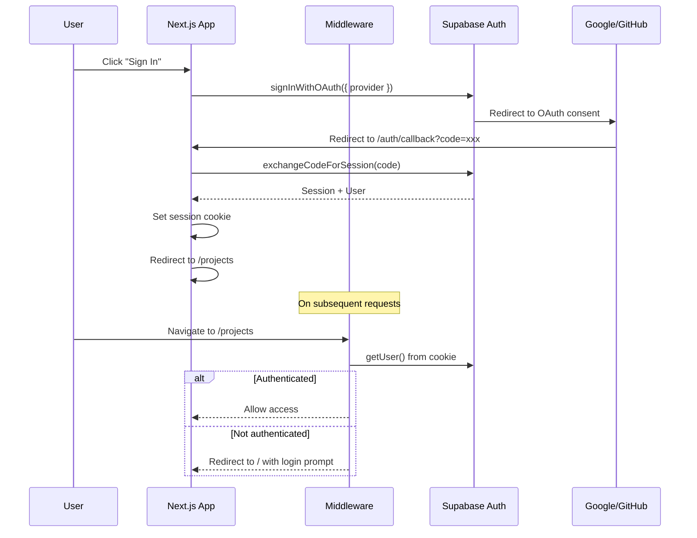
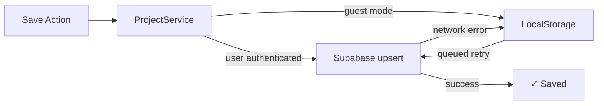

# PiForge Platform — Technical Design Document

## Overview

PiForge Platform (Phase 2) extends the existing PiForge simulator with platform-level features that transform it from a single-page tool into a multi-page web application. The core simulator (board rendering, breadboard, components, wiring, Pyodide Python execution) is fully built and currently served at `/`. This phase adds:

1. **Route restructuring** — Move the simulator to `/lab`, add a landing page at `/`
2. **Landing page** — Dark-themed marketing page with hero, features, showcase, and CTAs
3. **Authentication** — Supabase Auth with Google/GitHub OAuth, session management, guest mode fallback
4. **Cloud storage** — Supabase PostgreSQL with RLS for multi-project persistence
5. **Project explorer** — Dashboard at `/projects` with card grid, search, CRUD operations
6. **Guided tutorials** — Step-by-step interactive tutorials with completion detection
7. **Shareable links** — Public read-only project URLs with fork capability

The existing tech stack (Next.js, React 19, TypeScript, Tailwind CSS, Zustand, react-konva, Pyodide) is preserved. New dependencies: `@supabase/supabase-js`, `@supabase/ssr` for auth/database, and `framer-motion` for landing page animations.

## Architecture

### Route Structure

```
/                    → Landing page (new)
/lab                 → Simulator workspace (moved from /)
/lab?project={id}    → Simulator with specific cloud project loaded
/lab?tutorial={id}   → Simulator in tutorial mode
/projects            → Project explorer dashboard (auth required)
/share/{shareId}     → Shared project read-only view
/auth/callback       → OAuth redirect handler
```

### High-Level Architecture (Phase 2 Additions)



### Auth Flow



### Storage Strategy

The `ProjectService` abstracts storage behind a unified interface. When the user is authenticated, it uses Supabase. In guest mode, it falls back to LocalStorage (existing behavior). The service also handles offline resilience — if a cloud save fails, it writes to LocalStorage and queues a retry.



### Key Architectural Decisions

| Decision | Choice | Rationale |
|---|---|---|
| Auth provider | Supabase Auth | Already using Supabase for DB; unified SDK; built-in OAuth flows; cookie-based sessions via `@supabase/ssr` |
| Database | Supabase PostgreSQL | Managed Postgres with RLS; JSONB for circuit data; no separate backend needed |
| Route protection | Next.js middleware | Intercepts requests before rendering; lightweight; no client-side flash of protected content |
| Session storage | HTTP-only cookies via `@supabase/ssr` | Secure; works with SSR; auto-refresh; no manual token management |
| Project data format | JSONB column (`circuit_data`) | Stores the existing `ProjectFile` JSON directly; no schema migration needed for circuit data; queryable if needed |
| Landing page animations | `framer-motion` | Lightweight; React-native; scroll-triggered animations; already common in Next.js ecosystem |
| Tutorial definitions | Static JSON/TS files | No database needed; version-controlled; fast to load; easy to author |
| Tutorial completion detection | Store subscription + condition functions | Each step defines a predicate that checks Zustand store state; reactive; no polling |
| Shared project view | Same Lab component with `readOnly` prop | Reuses all rendering; disables interaction handlers; minimal new code |
| Thumbnail generation | Canvas `toDataURL()` on save | Already have Konva stage access; generates PNG data URL; stored as text in DB |

## Components and Interfaces

### 1. Supabase Client Setup

Two client factories following Supabase SSR patterns:

```typescript
// lib/supabase/client.ts — Browser client (Client Components)
import { createBrowserClient } from '@supabase/ssr';

export function createClient() {
  return createBrowserClient(
    process.env.NEXT_PUBLIC_SUPABASE_URL!,
    process.env.NEXT_PUBLIC_SUPABASE_ANON_KEY!
  );
}
```

```typescript
// lib/supabase/server.ts — Server client (Server Components, Route Handlers, Middleware)
import { createServerClient } from '@supabase/ssr';
import { cookies } from 'next/headers';

export async function createServerSupabaseClient() {
  const cookieStore = await cookies();
  return createServerClient(
    process.env.NEXT_PUBLIC_SUPABASE_URL!,
    process.env.NEXT_PUBLIC_SUPABASE_ANON_KEY!,
    {
      cookies: {
        getAll: () => cookieStore.getAll(),
        setAll: (cookiesToSet) => {
          cookiesToSet.forEach(({ name, value, options }) =>
            cookieStore.set(name, value, options)
          );
        },
      },
    }
  );
}
```

### 2. AuthProvider (React Context)

Wraps the app in `app/layout.tsx`. Provides session state to all client components.

```typescript
// components/providers/AuthProvider.tsx
interface AuthContextValue {
  user: User | null;
  session: Session | null;
  isLoading: boolean;
  signInWithOAuth: (provider: 'google' | 'github') => Promise<void>;
  signOut: () => Promise<void>;
}
```

The provider initializes by calling `supabase.auth.getSession()` on mount and subscribes to `onAuthStateChange` for real-time session updates (e.g., token refresh, sign-out from another tab).

### 3. Next.js Middleware

```typescript
// middleware.ts
// Protects /projects route — redirects unauthenticated users to /
// Refreshes session on every request to keep cookies alive
// Passes through all other routes (/, /lab, /share/*)
```

Protected routes: `/projects`. The middleware calls `supabase.auth.getUser()` and redirects to `/` if no valid session exists.

### 4. ProjectService

Unified CRUD interface that abstracts storage backend:

```typescript
// lib/projects/service.ts
interface ProjectService {
  list(): Promise<ProjectSummary[]>;
  get(id: string): Promise<ProjectRecord | null>;
  create(name?: string): Promise<ProjectRecord>;
  save(id: string, data: ProjectFile, thumbnail?: string): Promise<void>;
  rename(id: string, name: string): Promise<void>;
  delete(id: string): Promise<void>;
  share(id: string): Promise<string>;       // returns shareId
  unshare(id: string): Promise<void>;
  getShared(shareId: string): Promise<ProjectRecord | null>;
  fork(shareId: string): Promise<ProjectRecord>;
}

interface ProjectSummary {
  id: string;
  name: string;
  thumbnailUrl: string | null;
  updatedAt: string;
  isPublic: boolean;
}

interface ProjectRecord extends ProjectSummary {
  userId: string;
  description: string | null;
  circuitData: ProjectFile;
  shareId: string | null;
  createdAt: string;
}
```

Two implementations:
- `SupabaseProjectService` — uses Supabase client for authenticated users
- `LocalProjectService` — wraps existing LocalStorage serializer for guest mode

### 5. Landing Page Components

```typescript
// app/page.tsx (new landing page)
// Components:
//   - LandingNav: Top navigation with logo, "Launch Lab", "Sign In" / "Go to Projects"
//   - HeroSection: Headline, subheadline, CTA button, animated circuit visual
//   - FeatureCards: Grid of 4 cards (Board Sim, Wiring, Code Execution, Components)
//   - ShowcaseSection: Screenshot or embedded mini-demo of the simulator
//   - TutorialsPreview: Links to guided tutorials
//   - Footer: GitHub link, license, attribution
```

The hero animation uses `framer-motion` for a subtle circuit-trace animation (SVG path drawing effect) that conveys the electronics prototyping concept without being heavy.

### 6. Project Explorer Page

```typescript
// app/projects/page.tsx
// Server Component that fetches project list via Supabase server client
// Renders ProjectGrid client component

// components/projects/ProjectGrid.tsx
// Client component with:
//   - Search input (filters by name, client-side)
//   - "New Project" button
//   - Grid of ProjectCard components
//   - Empty state when no projects exist

// components/projects/ProjectCard.tsx
// Displays: thumbnail, name (editable inline), relative time
// Actions: open (navigate to /lab?project=id), rename, delete, share toggle
```

### 7. Tutorial System

```typescript
// lib/tutorials/types.ts
interface TutorialDefinition {
  id: string;
  title: string;
  description: string;
  difficulty: 'beginner' | 'intermediate';
  estimatedMinutes: number;
  initialState: ProjectFile;          // pre-built circuit state to load
  steps: TutorialStep[];
}

interface TutorialStep {
  id: string;
  title: string;
  content: string;                    // Markdown instruction text
  completionCondition: CompletionCondition;
  hints?: string[];
}

type CompletionCondition =
  | { type: 'component-placed'; definitionId: string }
  | { type: 'wire-connected'; fromPin: PinRef; toPin: PinRef }
  | { type: 'code-contains'; snippet: string }
  | { type: 'simulation-started' }
  | { type: 'breadboard-added' }
  | { type: 'board-selected'; model: string }
  | { type: 'manual' };              // user clicks "Done" button
```

The `TutorialEngine` subscribes to the Zustand store and evaluates the current step's `completionCondition` on every state change. When the condition is met, it auto-advances to the next step.

```typescript
// lib/tutorials/engine.ts
class TutorialEngine {
  private unsubscribe: (() => void) | null = null;

  start(tutorial: TutorialDefinition): void;
  getCurrentStep(): TutorialStep;
  getProgress(): { current: number; total: number; completed: boolean[] };
  checkCompletion(): boolean;         // evaluates current step condition
  advance(): void;                    // move to next step
  stop(): void;                       // cleanup subscription
}
```

Tutorial mode is sandboxed: starting a tutorial saves the current project state to a temporary slot, loads the tutorial's `initialState`, and restores the original state when the tutorial ends.

### 8. Shared Project View

The `/share/[shareId]` route reuses the Lab page component with a `readOnly` flag:

```typescript
// app/share/[id]/page.tsx
// Server Component:
//   1. Fetch project by share_id where is_public = true
//   2. If not found → render "Project not found" message
//   3. If found → render Lab with readOnly=true and circuitData pre-loaded

// Lab modifications for read-only mode:
//   - Disable drag handlers on components
//   - Disable wire creation interaction layer
//   - Disable code editor editing (Monaco readOnly option)
//   - Hide save button, show "Fork" button instead
//   - Simulation (play/pause/reset) remains functional
```

### 9. Updated TopBar

The existing `TopBar` component gains auth-aware elements:

```typescript
// Additions to TopBar:
// - Left: "PiForge" logo links to / instead of being static
// - Right: User avatar + dropdown (when authenticated) OR "Sign In" button (guest)
// - Right: Project name display + edit (when cloud project loaded)
// - Share button wired to ProjectService.share()
```

### 10. OAuth Callback Route

```typescript
// app/auth/callback/route.ts
// Next.js Route Handler (GET):
//   1. Extract `code` from URL search params
//   2. Exchange code for session via Supabase server client
//   3. Redirect to /projects on success
//   4. Redirect to /?error=auth_failed on failure
```

## Data Models

### Supabase Database Schema

```sql
-- projects table
CREATE TABLE projects (
  id UUID PRIMARY KEY DEFAULT gen_random_uuid(),
  user_id UUID NOT NULL REFERENCES auth.users(id) ON DELETE CASCADE,
  name TEXT NOT NULL DEFAULT 'Untitled Project',
  description TEXT,
  thumbnail_url TEXT,
  circuit_data JSONB NOT NULL DEFAULT '{}'::jsonb,
  is_public BOOLEAN NOT NULL DEFAULT false,
  share_id UUID UNIQUE,
  created_at TIMESTAMPTZ NOT NULL DEFAULT now(),
  updated_at TIMESTAMPTZ NOT NULL DEFAULT now()
);

-- Indexes
CREATE INDEX idx_projects_user_id ON projects(user_id);
CREATE INDEX idx_projects_share_id ON projects(share_id) WHERE share_id IS NOT NULL;
CREATE INDEX idx_projects_updated_at ON projects(user_id, updated_at DESC);

-- Row Level Security
ALTER TABLE projects ENABLE ROW LEVEL SECURITY;

-- Policy: Users can CRUD their own projects
CREATE POLICY "Users manage own projects"
  ON projects
  FOR ALL
  USING (auth.uid() = user_id)
  WITH CHECK (auth.uid() = user_id);

-- Policy: Anyone can read public projects (for share links)
CREATE POLICY "Public projects are readable"
  ON projects
  FOR SELECT
  USING (is_public = true);

-- Auto-update updated_at
CREATE OR REPLACE FUNCTION update_updated_at()
RETURNS TRIGGER AS $$
BEGIN
  NEW.updated_at = now();
  RETURN NEW;
END;
$$ LANGUAGE plpgsql;

CREATE TRIGGER projects_updated_at
  BEFORE UPDATE ON projects
  FOR EACH ROW
  EXECUTE FUNCTION update_updated_at();
```

### ProjectFile (circuit_data JSONB)

The existing `ProjectFile` interface from `lib/serialization/serializer.ts` is stored directly in the `circuit_data` JSONB column. No schema changes needed — the same Zod validation from `lib/serialization/schema.ts` applies.

```typescript
// Existing — stored as-is in circuit_data column
interface ProjectFile {
  version: number;
  metadata: { id: string; name: string; createdAt: string; updatedAt: string };
  board: { model: string; position: Point };
  components: unknown[];
  breadboards: unknown[];
  wires: unknown[];
  code: { content: string; language: string };
  settings: Record<string, unknown>;
}
```

### Tutorial Definition Schema

```typescript
interface TutorialDefinition {
  id: string;                         // e.g. "blink-led"
  title: string;                      // "Blink an LED"
  description: string;
  difficulty: 'beginner' | 'intermediate';
  estimatedMinutes: number;
  initialState: ProjectFile;          // pre-configured circuit
  steps: TutorialStep[];
}

interface TutorialStep {
  id: string;
  title: string;
  content: string;                    // Markdown
  completionCondition: CompletionCondition;
  hints?: string[];
}
```

### Auth Types

```typescript
// From @supabase/supabase-js — used throughout the app
interface User {
  id: string;
  email: string;
  user_metadata: {
    avatar_url?: string;
    full_name?: string;
    name?: string;
  };
}

interface Session {
  access_token: string;
  refresh_token: string;
  user: User;
  expires_at: number;
}
```


## Correctness Properties

*A property is a characteristic or behavior that should hold true across all valid executions of a system — essentially, a formal statement about what the system should do. Properties serve as the bridge between human-readable specifications and machine-verifiable correctness guarantees.*

### Property 1: Project Save/Load Round Trip

*For any* valid `ProjectFile` (with arbitrary board model, components, breadboards, wires, and code), saving it via `ProjectService.save()` and then loading it via `ProjectService.get()` shall produce a `circuit_data` object that is deeply equal to the original `ProjectFile`.

**Validates: Requirements 4.3, 4.4**

### Property 2: RLS Access Control

*For any* user A and any project owned by user B (where A ≠ B), user A's attempts to update or delete that project shall fail. If the project has `is_public = false`, user A's read attempt shall also fail. If `is_public = true`, user A's read shall succeed but write shall still fail.

**Validates: Requirements 4.2, 7.6**

### Property 3: Project Count Integrity

*For any* user and any number N of projects created via `ProjectService.create()`, calling `ProjectService.list()` shall return exactly N project summaries, each with a unique ID.

**Validates: Requirements 4.5, 5.1**

### Property 4: Project Search Filter Correctness

*For any* search query string and any set of projects with arbitrary names, the filtered results from the Project Explorer search shall contain exactly the projects whose names include the query as a case-insensitive substring. No matching project shall be excluded, and no non-matching project shall be included.

**Validates: Requirements 5.7**

### Property 5: Project Sort Order

*For any* list of projects with distinct `updatedAt` timestamps, the Project Explorer shall display them sorted by `updatedAt` in descending order (most recently edited first).

**Validates: Requirements 5.8**

### Property 6: Project Card Navigation URL

*For any* project with ID `pid`, clicking its card in the Project Explorer shall produce a navigation to the URL `/lab?project={pid}`.

**Validates: Requirements 5.4**

### Property 7: Project Card Required Fields

*For any* project displayed in the Project Explorer, its card shall render the project name, a thumbnail image (or placeholder), and a relative time string derived from the `updatedAt` timestamp.

**Validates: Requirements 5.2**

### Property 8: Feature Card Completeness

*For any* feature card rendered in the Landing Page feature highlights section, the card shall contain an icon element, a title string, and a description string. The section shall contain at least four such cards.

**Validates: Requirements 2.4**

### Property 9: Tutorial Initial State Loading

*For any* tutorial definition, when the tutorial is started, the Zustand project store state (board model, components, breadboards, wires, code) shall match the tutorial's `initialState` field.

**Validates: Requirements 6.2**

### Property 10: Tutorial Panel State Correctness

*For any* tutorial at step index `i` (where `0 ≤ i < totalSteps`), the Tutorial Panel shall display the content from `steps[i].content`, and the progress indicator shall show `current = i + 1`, `total = totalSteps`, with `completed[j] = true` for all `j < i`.

**Validates: Requirements 6.3, 6.4**

### Property 11: Tutorial Completion Detection

*For any* tutorial step with a `completionCondition`, when the Zustand store state satisfies that condition (e.g., a component with the specified `definitionId` exists in the store for a `component-placed` condition), the TutorialEngine shall report the step as complete and advance to the next step.

**Validates: Requirements 6.5**

### Property 12: Tutorial Sandbox Round Trip

*For any* existing project state in the Zustand store, starting a tutorial and then stopping it shall restore the store to the exact pre-tutorial state. The tutorial's `initialState` shall not persist after the tutorial ends.

**Validates: Requirements 6.12**

### Property 13: Share Link Generation

*For any* project, activating the share action shall produce a `share_id` that is a valid UUID, set `is_public` to `true`, and generate a URL matching the pattern `/share/{share_id}`.

**Validates: Requirements 7.1, 7.2**

### Property 14: Shared Project Read-Only Mode

*For any* shared project loaded via a share link, the Lab shall have editing disabled: component drag handlers inactive, wire creation disabled, and the Monaco editor in read-only mode. Simulation controls (play, pause, reset) shall remain functional.

**Validates: Requirements 7.3**

### Property 15: Unshare Revokes Access

*For any* previously shared project, after the owner calls `ProjectService.unshare()`, the project's `is_public` shall be `false`, `share_id` shall be `null`, and `ProjectService.getShared()` with the old share ID shall return `null`.

**Validates: Requirements 7.7**

## Error Handling

### Authentication Errors

| Scenario | Handling |
|---|---|
| OAuth provider error (e.g., user denies consent) | `/auth/callback` route detects missing/invalid code, redirects to `/?error=auth_failed`. Landing page displays toast: "Sign-in failed. Please try again." |
| Session expired during use | `onAuthStateChange` fires `SIGNED_OUT` event. AuthProvider clears user state. If on `/projects`, redirect to `/`. If on `/lab`, switch to guest mode with LocalStorage fallback. Display toast: "Session expired. Your work is saved locally." |
| Supabase service unavailable | Auth calls fail with network error. Display toast: "Unable to connect. Working in offline mode." Lab continues functioning with LocalStorage. |

### Cloud Storage Errors

| Scenario | Handling |
|---|---|
| Save fails (network error) | `ProjectService.save()` catches error, falls back to `saveToLocalStorage()`, displays warning toast: "Cloud save failed. Saved locally. Will retry." Queues retry with exponential backoff (1s, 2s, 4s, max 30s). |
| Load fails (network error) | `ProjectService.get()` catches error, attempts to load from LocalStorage if available. Displays warning. |
| RLS violation (shouldn't happen in normal flow) | Supabase returns 403. Log error. Display: "Permission denied." |
| Project not found (deleted or invalid ID) | `ProjectService.get()` returns null. Redirect to `/projects` with toast: "Project not found." |

### Share Link Errors

| Scenario | Handling |
|---|---|
| Invalid share_id format | `/share/[id]` page validates UUID format. If invalid, render "Project not found" with link to home. |
| Share_id not found or project no longer public | `ProjectService.getShared()` returns null. Render "This project is no longer shared" with link to home. |
| Fork fails | Display error toast. User can retry. |

### Tutorial Errors

| Scenario | Handling |
|---|---|
| Tutorial definition missing/corrupt | Skip tutorial in list. Log error. |
| Completion condition never met (user stuck) | Each step has optional hints. After 60 seconds on a step, display first hint. "Skip Step" button always available. |
| Sandbox restore fails | Log error. User's project state may be lost for that session. Display warning. LocalStorage backup of pre-tutorial state provides recovery. |

## Testing Strategy

### Dual Testing Approach

PiForge Platform uses both unit tests and property-based tests for comprehensive coverage:

- **Unit tests** — Verify specific examples, edge cases, integration points, and error conditions
- **Property-based tests** — Verify universal properties across randomly generated inputs using `fast-check` (already in devDependencies)

### Property-Based Testing Configuration

- Library: `fast-check` (v4.6.0, already installed)
- Minimum iterations: 100 per property test
- Each property test references its design document property via comment tag
- Tag format: `Feature: piforge-platform, Property {number}: {property_text}`
- Each correctness property is implemented by a single property-based test

### Unit Tests

| Area | Tests |
|---|---|
| Route structure | Landing page renders at `/`, Lab renders at `/lab`, `/projects` requires auth |
| Landing page | Hero section has CTA linking to `/lab`, feature cards render, footer has links |
| Auth callback | Valid code → redirect to `/projects`, invalid code → redirect with error |
| Auth context | Authenticated state shows avatar, guest state shows "Sign In" |
| Middleware | Unauthenticated `/projects` → redirect, authenticated → pass through |
| ProjectService | Create returns default name, delete removes project, rename updates name |
| Project Explorer | Empty state renders CTA, new project button works, delete shows confirmation |
| Tutorial definitions | Each of the 4 tutorials has valid structure and required steps |
| Tutorial panel | Completion message at final step, hints display after timeout |
| Share flow | Share generates link, fork creates independent copy, unshare clears access |
| Read-only mode | Editor is read-only, drag disabled, simulation controls work |
| Offline fallback | Network error triggers LocalStorage save with warning |

### Property-Based Tests

| Property | Test Description |
|---|---|
| Property 1 | Generate random `ProjectFile` objects (random board models, component arrays, wire arrays, code strings). Save then load. Assert deep equality. |
| Property 2 | Generate random user pairs and project ownership. Assert non-owner CRUD fails. Assert public read succeeds, public write fails. |
| Property 3 | Generate random N (1–50). Create N projects. List. Assert count = N and all IDs unique. |
| Property 4 | Generate random project names and search queries. Filter. Assert result set matches case-insensitive substring inclusion. |
| Property 5 | Generate random lists of projects with random timestamps. Sort. Assert descending order by `updatedAt`. |
| Property 6 | Generate random project IDs (UUIDs). Assert navigation URL matches `/lab?project={id}`. |
| Property 7 | Generate random project data (name, thumbnail, updatedAt). Render card. Assert all fields present. |
| Property 8 | Generate random feature card data (icon, title, description). Render section. Assert each card has all three elements and count ≥ 4. |
| Property 9 | Generate random tutorial definitions with random `initialState`. Start tutorial. Assert store matches `initialState`. |
| Property 10 | Generate random tutorial with N steps. For each step index i, assert panel shows correct content and progress numbers. |
| Property 11 | Generate random completion conditions and matching store states. Assert TutorialEngine detects completion and advances. |
| Property 12 | Generate random project state. Start tutorial (loads different state). Stop tutorial. Assert original state restored. |
| Property 13 | Generate random project IDs. Share. Assert share_id is valid UUID, is_public is true, URL matches pattern. |
| Property 14 | Generate random shared projects. Load in share mode. Assert editor readOnly, drag handlers disabled, simulation controls enabled. |
| Property 15 | Generate random shared projects. Unshare. Assert is_public false, share_id null, getShared returns null. |

### Test File Organization

```
__tests__/
  properties/
    project-storage-properties.test.ts    # Properties 1, 2, 3
    project-explorer-properties.test.ts   # Properties 4, 5, 6, 7
    landing-page-properties.test.ts       # Property 8
    tutorial-properties.test.ts           # Properties 9, 10, 11, 12
    sharing-properties.test.ts            # Properties 13, 14, 15
  unit/
    auth.test.ts
    middleware.test.ts
    project-service.test.ts
    project-explorer.test.ts
    landing-page.test.ts
    tutorial-system.test.ts
    share-flow.test.ts
```
