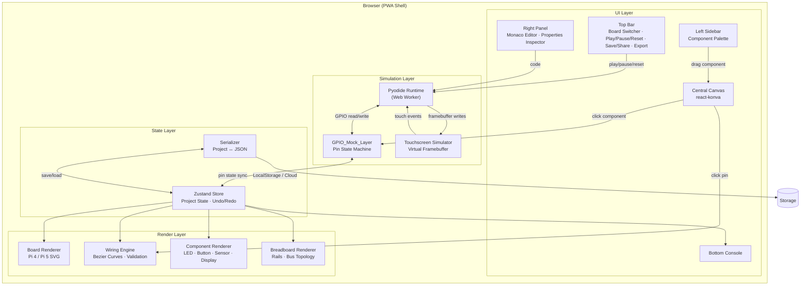

# PiForge — Technical Design Document

## Overview

PiForge is a browser-first virtual Raspberry Pi laboratory built with Next.js 15, React 19, and TypeScript. It enables makers, students, and IoT builders to drag realistic Pi 4/Pi 5 boards onto an infinite canvas, wire up breadboards with high-fidelity components (including programmable touchscreens), and run Python code in-browser via Pyodide — all without physical hardware.

The system is structured around five core subsystems:

1. **Canvas & Rendering** — react-konva 2D canvas with pan/zoom, component placement, and wire rendering
2. **Simulation Engine** — Pyodide-based Python execution with a GPIO mock layer bridging code ↔ circuit state
3. **Touchscreen Simulator** — Virtual framebuffer canvas for pygame/PIL output with mapped touch input events
4. **State Management** — Zustand store with project serialization, persistence, and undo/redo
5. **Editor & UI Shell** — Monaco editor, component palette, properties inspector, console, and PWA shell

### Phase 1 vs Phase 2 Boundary

| Phase 1 (v1 Launch) | Phase 2 |
|---|---|
| 2D canvas + pan/zoom + snap grid | 3D rotatable board view (@react-three/fiber) |
| Pi 4 & Pi 5 board rendering (2D) | Collaboration service (WebSocket) |
| Breadboard with standard topology | Fritzing .fzz export |
| Wiring engine with bezier curves + validation | GitHub Gist export |
| Component library (LED, button, potentiometer, DHT22, HC-SR04, servo, touchscreen) | Full DSI/SPI protocol emulation |
| Python execution via Pyodide + GPIO Zero mock | C++ WASM execution |
| Touchscreen simulator (virtual framebuffer + simulated DSI flag) | Multi-touch calibration |
| Monaco editor with templates | AI Helper pane |
| Project save/load (LocalStorage) | Cloud persistence (Supabase/Firebase) |
| PNG export + Build Guide export | Step debugger (breakpoints, watch panel) |
| PWA shell with offline support | Simulated WiFi/MQTT stub |

## Architecture

### High-Level Architecture Diagram



### Pyodide ↔ GPIO_Mock_Layer Bridge (Critical Path)

The GPIO_Mock_Layer is the heart of the simulation. It runs in the main thread and communicates with Pyodide (running in a Web Worker) via `SharedArrayBuffer` for low-latency pin state synchronization.

```mermaid
sequenceDiagram
    participant Code as Python Code (Worker)
    participant Pyodide as Pyodide Runtime (Worker)
    participant SAB as SharedArrayBuffer
    participant GPIO as GPIO_Mock_Layer (Main)
    participant Store as Zustand Store
    participant Canvas as Canvas Renderer

    Code->>Pyodide: import gpiozero; led = LED(17)
    Pyodide->>SAB: Write pin 17 mode = OUTPUT
    GPIO->>SAB: Poll pin state changes
    GPIO->>Store: dispatch(setPinMode(17, OUTPUT))

    Code->>Pyodide: led.on()
    Pyodide->>SAB: Write pin 17 value = HIGH
    GPIO->>SAB: Read pin 17 = HIGH
    GPIO->>Store: dispatch(setPinValue(17, HIGH))
    Store->>Canvas: Re-render LED → illuminated

    Note over Canvas,GPIO: User clicks a button component
    Canvas->>Store: dispatch(setPinValue(4, HIGH))
    Store->>GPIO: Pin 4 changed
    GPIO->>SAB: Write pin 4 value = HIGH
    Pyodide->>SAB: Read pin 4 = HIGH (edge callback fires)
    Pyodide->>Code: button.when_pressed callback
```

### Key Architectural Decisions

| Decision | Choice | Rationale |
|---|---|---|
| 2D Canvas library | react-konva | Mature React bindings for Konva.js; hardware-accelerated via HTML5 Canvas; supports hit detection, layering, drag-and-drop natively |
| 3D rendering (Phase 2) | @react-three/fiber + drei | React-native Three.js integration; drei provides orbit controls, realistic materials; deferred to Phase 2 to reduce v1 scope |
| Python runtime | Pyodide (WASM) | Full CPython in browser; supports numpy, pygame (SDL stub); no server needed; runs in Web Worker for non-blocking UI |
| State management | Zustand | Minimal boilerplate; supports middleware (immer for immutable updates, persist for LocalStorage); fast selector-based re-renders |
| Code editor | Monaco Editor (@monaco-editor/react) | VS Code-grade editing; built-in Python/C++ language support; syntax highlighting, autocomplete, error markers |
| Pin state transport | SharedArrayBuffer | Sub-millisecond read/write between Worker and main thread; avoids postMessage serialization overhead; critical for 50ms GPIO latency target |
| Touchscreen framebuffer | OffscreenCanvas (transferred to Worker) | Pyodide pygame/PIL writes directly to canvas; main thread composites onto react-konva layer; avoids pixel copy overhead |
| Styling | Tailwind CSS + shadcn/ui | Utility-first CSS with pre-built accessible components; dark mode via CSS variables; consistent with modern React ecosystem |
| Icons | lucide-react | Lightweight, tree-shakeable SVG icons; consistent design language |
| Monorepo structure | Turborepo (optional) or flat Next.js app | Phase 1 uses flat `/app`, `/components`, `/lib`, `/stores` structure; Turborepo added if packages split in Phase 2 |


## Components and Interfaces

### 1. Board Renderer

Renders accurate 2D representations of Pi 4 and Pi 5 boards on the react-konva canvas.

```typescript
// lib/boards/types.ts
interface BoardModel {
  id: 'pi4' | 'pi5';
  name: string;
  dimensions: { width: number; height: number }; // mm, rendered proportionally
  gpioHeader: PinDefinition[];       // 40 pins, identical layout
  ports: PortDefinition[];           // USB, HDMI, Ethernet, CSI, DSI, etc.
  mountingHoles: Point[];            // from official mechanical drawings
  svgAsset: string;                  // path to SVG template
}

interface PinDefinition {
  pinNumber: number;                 // physical pin 1–40
  gpioNumber: number | null;         // BCM GPIO number (null for power/ground)
  label: string;                     // e.g. "GPIO17", "3V3", "GND"
  type: 'gpio' | 'power' | 'ground' | 'i2c' | 'spi' | 'uart' | 'pwm';
  altFunctions: string[];            // e.g. ["SPI0_MOSI", "PWM0"]
  position: Point;                   // relative to board origin
}

interface PortDefinition {
  id: string;
  label: string;
  type: 'usb-a' | 'usb-c' | 'hdmi-micro' | 'ethernet' | 'csi' | 'dsi' | 'pcie' | 'audio';
  position: Point;
  dimensions: { width: number; height: number };
}
```

The board definitions for Pi 4 and Pi 5 are stored as static JSON files under `/lib/boards/pi4.json` and `/lib/boards/pi5.json`. The 40-pin GPIO header is shared between both models (backward compatible). Port layouts differ (Pi 5 adds PCIe, rearranges USB).

### 2. Canvas System

The canvas is a react-konva `<Stage>` with pan/zoom managed via Konva's built-in `draggable` stage and scale transforms.

```typescript
// stores/canvasStore.ts
interface CanvasState {
  viewport: { x: number; y: number; scale: number };
  placedComponents: PlacedComponent[];
  placedBoards: PlacedBoard[];
  breadboards: PlacedBreadboard[];
  wires: Wire[];
  selectedIds: string[];
  snapToGrid: boolean;
  gridSize: number; // default 10px
}
```

Performance strategy for 60 fps with 50+ components:
- **Layer separation**: Konva layers for (1) background/grid, (2) breadboards, (3) components, (4) wires, (5) overlay/selection. Only dirty layers re-render.
- **Viewport culling**: Components outside the visible viewport are not rendered (react-konva `visible` prop based on intersection with viewport rect).
- **Memoization**: Each component is wrapped in `React.memo` with shallow equality on its state slice. Pin state changes only re-render the affected component.
- **Batched state updates**: GPIO state changes are batched at 60Hz via `requestAnimationFrame` before dispatching to Zustand, preventing per-pin re-renders.
- **Canvas caching**: Static components (breadboard, board) use Konva's `cache()` to rasterize complex shapes into bitmaps.

### 3. Component Library

Components are defined as JSON and loaded at startup. The schema is extensible for user-defined components.

```typescript
// lib/components/types.ts
interface ComponentDefinition {
  id: string;                        // unique slug, e.g. "led-red"
  name: string;                      // display name
  category: ComponentCategory;
  pins: ComponentPinDef[];
  visual: {
    svgAsset: string;
    width: number;
    height: number;
    states: Record<string, string>;  // state → SVG variant (e.g. "on" → "led-red-on.svg")
  };
  simulation: SimulationBehavior;
  defaultProperties: Record<string, number | string | boolean>;
}

type ComponentCategory =
  | 'led' | 'button' | 'switch' | 'potentiometer'
  | 'buzzer' | 'sensor' | 'motor' | 'display'
  | 'keypad' | 'touchscreen' | 'passive';

interface ComponentPinDef {
  id: string;                        // e.g. "anode", "cathode", "vcc"
  label: string;
  type: 'power' | 'ground' | 'signal' | 'data';
  position: Point;                   // relative to component origin
  direction: 'in' | 'out' | 'bidirectional';
}

interface SimulationBehavior {
  type: 'digital-output' | 'digital-input' | 'analog-input' | 'pwm' | 'i2c-device' | 'spi-device' | 'display';
  handler: string;                   // reference to simulation handler module
  properties: Record<string, unknown>;
}
```

Component JSON schema validation uses Zod at load time. Custom components added by users are validated against the same schema before being added to the palette.

### 4. Wiring Engine

Manages wire creation, rendering, validation, and electrical analysis.

```typescript
// lib/wiring/types.ts
interface Wire {
  id: string;
  startPinRef: PinRef;              // { componentId, pinId } or { breadboardId, row, col }
  endPinRef: PinRef;
  color: WireColor;                 // auto-assigned by connection type, overridable
  path: Point[];                    // bezier control points
  validated: boolean;
  warnings: WireWarning[];
}

type WireColor = 'red' | 'black' | 'blue' | 'green' | 'yellow' | 'white' | 'orange';

interface WireWarning {
  type: 'short-circuit' | 'over-voltage' | 'over-current' | 'unconnected';
  message: string;
  severity: 'error' | 'warning';
}

type PinRef =
  | { type: 'component'; componentId: string; pinId: string }
  | { type: 'board'; boardId: string; pinNumber: number }
  | { type: 'breadboard'; breadboardId: string; row: number; col: number; rail?: 'positive' | 'negative' };
```

Wire color auto-assignment logic:
- Pin type `power` (3.3V/5V) → red
- Pin type `ground` → black
- Pin type `i2c` or `spi` → green
- All other GPIO/signal → blue

Short-circuit detection: The wiring engine builds a connectivity graph on each wire change. If any path connects a power pin to a ground pin with zero resistance components in between, a short-circuit warning is emitted.

### 5. GPIO_Mock_Layer

The critical bridge between Pyodide and the visual circuit. It emulates the GPIO hardware interface that Python libraries (GPIO Zero, RPi.GPIO) expect.

```typescript
// lib/simulation/gpio-mock.ts
interface GPIOMockLayer {
  // SharedArrayBuffer layout: 40 pins × 4 bytes each
  // Byte 0: mode (0=INPUT, 1=OUTPUT, 2=PWM, 3=ALT)
  // Byte 1: value (0=LOW, 1=HIGH)
  // Byte 2: PWM duty cycle (0–255)
  // Byte 3: flags (bit 0=edge_rising, bit 1=edge_falling, bit 2=pull_up, bit 3=pull_down)
  pinBuffer: SharedArrayBuffer;      // 40 × 4 = 160 bytes
  
  // Pi model determines driver behavior
  boardModel: 'pi4' | 'pi5';
  
  // GPIO Zero compatibility: works on both models (abstracts driver)
  // RPi.GPIO compatibility:
  //   Pi 4: direct register emulation (legacy raspi-gpio style)
  //   Pi 5: RP1 southbridge pinctrl emulation OR warning
  driverMode: 'gpiozero' | 'rpigpio-legacy' | 'rpigpio-rp1';
}
```

**Pi 4 vs Pi 5 GPIO Compatibility:**

| Library | Pi 4 | Pi 5 | Mock Strategy |
|---|---|---|---|
| GPIO Zero | ✅ Native | ✅ Native | Single mock; GPIO Zero abstracts the driver. The mock implements the `gpiozero.pins` factory interface. |
| RPi.GPIO | ✅ Native | ⚠️ Needs shim | Pi 4: mock `/dev/gpiomem` register layout. Pi 5: detect `RPi.GPIO` import → inject compatibility shim that maps legacy register calls to RP1 pinctrl equivalents. If shim fails, display console warning suggesting GPIO Zero. |
| lgpio / gpiod | ✅ | ✅ | Phase 2: mock `libgpiod` character device interface. |

The GPIO_Mock_Layer is injected into Pyodide as a Python package (`_piforge_gpio`) that monkey-patches `gpiozero.pins` and `RPi.GPIO` at import time. This is done via Pyodide's `micropip` and a virtual filesystem mount.

### 6. Touchscreen Simulator

Implements the virtual framebuffer approach for v1.

```typescript
// lib/simulation/touchscreen.ts
interface TouchscreenSimulator {
  resolution: { width: number; height: number };
  connectionType: 'dsi-simulated' | 'spi';
  framebufferCanvas: OffscreenCanvas;  // Python writes here
  displayCanvas: HTMLCanvasElement;     // composited onto react-konva
  inputEventQueue: TouchInputEvent[];
}

interface TouchInputEvent {
  type: 'touch_down' | 'touch_up' | 'touch_move';
  x: number;
  y: number;
  pressure: number;
  timestamp: number;
  // Multi-touch (Phase 2 full support; v1 supports single touch)
  contactId: number;
}
```

**Framebuffer flow:**
1. Python code (pygame/PIL) calls drawing functions
2. Pyodide's pygame SDL stub writes pixels to the `OffscreenCanvas` (transferred to Worker)
3. Main thread reads the `OffscreenCanvas` at 15+ fps via `requestAnimationFrame`
4. Composites framebuffer onto a Konva `Image` node positioned at the touchscreen component location
5. Mouse/touch events on the Konva `Image` are captured, coordinates transformed to framebuffer space, and pushed into `inputEventQueue`
6. Worker reads `inputEventQueue` via SharedArrayBuffer and delivers events to Python as Linux-style `/dev/input` events

**"Simulated DSI" flag:** When the official 7" touchscreen component is connected, the system auto-wires:
- Display output → framebuffer canvas (800×480 resolution)
- Touch input → I2C address 0x38 (FT5406 touch controller emulation)
- No manual SPI/I2C wiring required by the user

### 7. Simulation Engine (Pyodide Runtime)

```typescript
// lib/simulation/engine.ts
interface SimulationEngine {
  worker: Worker;
  state: 'idle' | 'running' | 'paused' | 'error';
  pyodideReady: boolean;
  
  // Control
  start(code: string): Promise<void>;
  pause(): void;
  resume(): void;
  reset(): void;
  
  // I/O
  stdout: ReadableStream<string>;
  stderr: ReadableStream<string>;
}
```

Pyodide initialization is lazy — the WASM binary (~25MB) is only fetched when the user first clicks Play. It's cached by the service worker for subsequent loads. Target: ready within 5 seconds of first Play click.

The worker thread runs:
1. Load Pyodide WASM
2. Mount virtual filesystem with `_piforge_gpio` package
3. Install user-requested packages via `micropip` (e.g., `gpiozero`)
4. Execute user code with `pyodide.runPythonAsync()`
5. Capture stdout/stderr via custom stream redirects
6. On pause: use `Atomics.wait()` on a control flag in SharedArrayBuffer
7. On reset: terminate worker and create a new one

### 8. State Store (Zustand)

```typescript
// stores/projectStore.ts
interface ProjectState {
  // Project metadata
  projectId: string;
  projectName: string;
  schemaVersion: number;
  
  // Board
  boardModel: 'pi4' | 'pi5';
  boardPosition: Point;
  
  // Circuit
  components: Record<string, PlacedComponent>;
  breadboards: Record<string, PlacedBreadboard>;
  wires: Record<string, Wire>;
  
  // Pin state (simulation)
  pinStates: Record<number, PinState>;  // keyed by physical pin number
  
  // Editor
  code: string;
  language: 'python' | 'micropython' | 'cpp';
  
  // Simulation
  simulationState: 'idle' | 'running' | 'paused' | 'error';
  consoleOutput: ConsoleEntry[];
  
  // Actions
  addComponent(def: ComponentDefinition, position: Point): string;
  removeComponent(id: string): void;
  addWire(start: PinRef, end: PinRef): string;
  removeWire(id: string): void;
  setPinState(pin: number, state: Partial<PinState>): void;
  setCode(code: string): void;
  serialize(): ProjectFile;
  deserialize(file: ProjectFile): void;
}
```

### 9. Project Serializer

```typescript
// lib/serialization/types.ts
interface ProjectFile {
  version: number;                   // schema version for migration
  metadata: {
    id: string;
    name: string;
    createdAt: string;               // ISO 8601
    updatedAt: string;
  };
  board: {
    model: 'pi4' | 'pi5';
    position: Point;
  };
  components: SerializedComponent[];
  breadboards: SerializedBreadboard[];
  wires: SerializedWire[];
  code: {
    content: string;
    language: 'python' | 'micropython' | 'cpp';
  };
  settings: Record<string, unknown>;
}
```

Schema validation uses Zod. Migration functions are registered per version bump:

```typescript
const migrations: Record<number, (old: unknown) => unknown> = {
  2: migrateV1toV2,
  3: migrateV2toV3,
  // ...
};
```

### 10. Export Engine

Phase 1 exports:
- **PNG**: Uses Konva's `stage.toDataURL()` at 2x resolution, then converts to downloadable PNG blob
- **Build Guide**: Iterates over components and wires, generates a Markdown document with a parts list, wiring table, and embedded code

Phase 2 exports (Fritzing, GitHub Gist) are deferred.


## Data Models

### PlacedComponent

```typescript
interface PlacedComponent {
  id: string;                        // UUID
  definitionId: string;              // references ComponentDefinition.id
  position: Point;                   // canvas coordinates
  rotation: number;                  // degrees (0, 90, 180, 270)
  properties: Record<string, number | string | boolean>;  // overrides from defaults
  pinStates: Record<string, PinState>;
  breadboardId?: string;             // if snapped to a breadboard
  breadboardRow?: number;
}

interface PinState {
  mode: 'input' | 'output' | 'pwm' | 'alt';
  value: 0 | 1;
  pwmDuty: number;                   // 0–1
  pullMode: 'up' | 'down' | 'none';
  edgeDetect: 'none' | 'rising' | 'falling' | 'both';
}
```

### PlacedBreadboard

```typescript
interface PlacedBreadboard {
  id: string;
  position: Point;
  type: '830-point' | '400-point';
  // Internal bus topology: rows a–e share a bus, rows f–j share a bus
  // Power rails: top positive/negative, bottom positive/negative
  // Connections are implicit based on row/column placement
}
```

### Wire (Serialized)

```typescript
interface SerializedWire {
  id: string;
  start: PinRef;
  end: PinRef;
  color: WireColor;
  controlPoints: Point[];            // bezier control points for path
}
```

### Point

```typescript
interface Point {
  x: number;
  y: number;
}
```

### ConsoleEntry

```typescript
interface ConsoleEntry {
  id: string;
  timestamp: number;
  stream: 'stdout' | 'stderr' | 'system';
  text: string;
}
```

### Connectivity Graph (Internal)

The wiring engine maintains an adjacency-list graph for electrical analysis:

```typescript
interface ConnectivityGraph {
  nodes: Map<string, ElectricalNode>;  // PinRef serialized as key
  edges: Map<string, string[]>;        // adjacency list
}

interface ElectricalNode {
  ref: PinRef;
  voltage: number | null;             // null = floating
  type: 'power' | 'ground' | 'signal' | 'bus';
}
```

Short-circuit detection traverses this graph using BFS from each power node. If a ground node is reachable through only zero-resistance paths, a short-circuit warning is emitted.

### Project File Schema (Zod)

```typescript
import { z } from 'zod';

const PointSchema = z.object({ x: z.number(), y: z.number() });

const PinRefSchema = z.discriminatedUnion('type', [
  z.object({ type: z.literal('component'), componentId: z.string(), pinId: z.string() }),
  z.object({ type: z.literal('board'), boardId: z.string(), pinNumber: z.number().int().min(1).max(40) }),
  z.object({
    type: z.literal('breadboard'),
    breadboardId: z.string(),
    row: z.number().int(),
    col: z.number().int(),
    rail: z.enum(['positive', 'negative']).optional(),
  }),
]);

const ProjectFileSchema = z.object({
  version: z.number().int().positive(),
  metadata: z.object({
    id: z.string().uuid(),
    name: z.string().min(1),
    createdAt: z.string().datetime(),
    updatedAt: z.string().datetime(),
  }),
  board: z.object({
    model: z.enum(['pi4', 'pi5']),
    position: PointSchema,
  }),
  components: z.array(z.object({
    id: z.string().uuid(),
    definitionId: z.string(),
    position: PointSchema,
    rotation: z.number(),
    properties: z.record(z.union([z.number(), z.string(), z.boolean()])),
    breadboardId: z.string().optional(),
    breadboardRow: z.number().int().optional(),
  })),
  breadboards: z.array(z.object({
    id: z.string().uuid(),
    position: PointSchema,
    type: z.enum(['830-point', '400-point']),
  })),
  wires: z.array(z.object({
    id: z.string().uuid(),
    start: PinRefSchema,
    end: PinRefSchema,
    color: z.enum(['red', 'black', 'blue', 'green', 'yellow', 'white', 'orange']),
    controlPoints: z.array(PointSchema),
  })),
  code: z.object({
    content: z.string(),
    language: z.enum(['python', 'micropython', 'cpp']),
  }),
  settings: z.record(z.unknown()),
});
```


## Correctness Properties

*A property is a characteristic or behavior that should hold true across all valid executions of a system — essentially, a formal statement about what the system should do. Properties serve as the bridge between human-readable specifications and machine-verifiable correctness guarantees.*

### Property 1: Board Dimension Proportionality

*For any* board model (Pi 4 or Pi 5), the ratio of the rendered board width to height shall equal the ratio of the physical board dimensions (85.6/56.5 for Pi 4, ~85/57 for Pi 5) within a 1% tolerance.

**Validates: Requirements 1.3**

### Property 2: GPIO Header Identity Across Models

*For any* two board models in the system, the 40-pin GPIO header definitions (pin numbers, GPIO numbers, labels, types, and relative positions) shall be identical.

**Validates: Requirements 1.4**

### Property 3: Breadboard Bus Topology Correctness

*For any* 830-point breadboard and any two points placed in the same row within the same bus group (columns a–e or columns f–j), the connectivity graph shall report those points as electrically connected. For any two points in different bus groups of the same row, they shall NOT be connected (unless explicitly wired).

**Validates: Requirements 2.2**

### Property 4: Multiple Breadboard Independence

*For any* number N of breadboards added to the canvas, the resulting state shall contain exactly N breadboard entries, each with an independent position, and modifying the position of one breadboard shall not affect any other breadboard's position.

**Validates: Requirements 2.3**

### Property 5: Component Snap-to-Grid

*For any* component drag position and any set of breadboard positions on the canvas, the snap function shall return either (a) the nearest valid breadboard row position if one exists within the snap tolerance, or (b) the nearest grid-aligned position otherwise. The snapped position shall never be farther from a valid target than the snap tolerance.

**Validates: Requirements 2.4**

### Property 6: Component Schema Validation

*For any* JSON object, if it conforms to the ComponentDefinition schema (has name, category, pins, visual, simulation, defaultProperties), the component library shall accept it. If it does not conform, the library shall reject it with a validation error. All built-in components shall pass this same validation.

**Validates: Requirements 3.2, 3.3**

### Property 7: Component Search Filter Correctness

*For any* search query string and any set of components in the library, every component returned by the filter function shall contain the query string (case-insensitive) in its name or category. No component matching the query shall be excluded from the results.

**Validates: Requirements 3.5**

### Property 8: Wire Creation Validity

*For any* two valid pin references, creating a wire between them shall produce a Wire object with a valid ID, the correct start and end pin references, a non-empty array of bezier control points, and a color assignment.

**Validates: Requirements 4.1**

### Property 9: Wire Color Auto-Assignment

*For any* wire connecting two pins, the auto-assigned wire color shall be: red if either pin is a power type, black if either pin is a ground type, green if either pin is an I2C or SPI data type, and blue for all other GPIO/signal connections. Power and ground take precedence over signal types.

**Validates: Requirements 4.2**

### Property 10: Wire Endpoint Snap

*For any* endpoint position and any set of pins on the canvas, the snap function shall return the nearest pin within a 10-pixel radius if one exists, or null otherwise. If a pin is returned, its distance from the endpoint shall be ≤ 10 pixels, and no other pin shall be closer.

**Validates: Requirements 4.3**

### Property 11: Electrical Hazard Detection

*For any* connectivity graph, if a path exists from a power node to a ground node through only zero-resistance connections, the validator shall emit a short-circuit warning. If a wire connects a power source whose voltage exceeds a component's rated voltage, the validator shall emit an over-voltage warning.

**Validates: Requirements 4.4, 4.5**

### Property 12: Electrical Continuity Detection

*For any* set of wires and breadboard connections, the continuity detector shall correctly identify all electrically connected paths. Two pins shall be reported as connected if and only if there exists a path between them through wires and/or breadboard bus connections. Current flow direction shall be consistent with the identified power source polarity.

**Validates: Requirements 4.6, 4.9**

### Property 13: Touchscreen Resolution Mapping

*For any* touchscreen component type, when connected to a board, the activated virtual display panel shall have a resolution matching the component's specification (800×480 for official 7" DSI, and the correct resolution for each Waveshare model). DSI touchscreens shall be auto-wired without manual SPI/I2C configuration.

**Validates: Requirements 5.1**

### Property 14: Touch Coordinate Transformation

*For any* click position (px, py) on the virtual display canvas of dimensions (cw, ch) mapped to a framebuffer of resolution (fw, fh), the resulting touch event coordinates shall be (px × fw/cw, py × fh/ch) rounded to the nearest integer, and shall be within the framebuffer bounds [0, fw) × [0, fh).

**Validates: Requirements 5.3**

### Property 15: Calibration Coordinate Mapping

*For any* set of calibration points (raw touch → display coordinate pairs), the resulting affine transformation matrix shall map each calibration point's raw coordinates to within 2 pixels of the expected display coordinates.

**Validates: Requirements 5.5**

### Property 16: Template Population

*For any* template in the template registry, selecting it shall set the editor content to a non-empty string and the language mode to the language specified by the template. The template code shall be syntactically valid for its declared language.

**Validates: Requirements 6.3**

### Property 17: GPIO Zero Cross-Model Compatibility

*For any* GPIO Zero operation (set pin mode, read pin, write pin, edge detection) and any valid GPIO pin number, the result shall be identical regardless of whether the board model is set to Pi 4 or Pi 5.

**Validates: Requirements 7.2**

### Property 18: GPIO Pin State Synchronization

*For any* valid GPIO pin number and any state change (mode, value, PWM duty, edge detection), writing the state to the SharedArrayBuffer from one side (Pyodide worker or main thread) shall result in the other side reading the identical state. The pin state in the Zustand store shall match the SharedArrayBuffer contents after synchronization.

**Validates: Requirements 7.3a, 7.3b**

### Property 19: Pause Preserves All State

*For any* simulation state (set of pin modes, values, PWM duties, and edge configurations), pausing the simulation shall not modify any pin state. The pin states before pause and after pause shall be identical.

**Validates: Requirements 7.4**

### Property 20: Reset Clears All State to Defaults

*For any* simulation state, resetting the simulation shall set all 40 pins to mode=INPUT, value=LOW, pwmDuty=0, pullMode=none, edgeDetect=none. No pin shall retain any pre-reset state.

**Validates: Requirements 7.5**

### Property 21: Console Output Correctness

*For any* string written to stdout or stderr by running code, a corresponding ConsoleEntry shall appear in the console output with the correct stream type and the exact text content.

**Validates: Requirements 7.6**

### Property 22: Project Serialization Round-Trip

*For any* valid project state, serializing it to a ProjectFile JSON and then deserializing the JSON back into project state shall produce a state equivalent to the original. Equivalence is defined as: same board model, same component set (with positions, rotations, properties), same wire set (with endpoints and colors), same code content and language, and same settings.

**Validates: Requirements 16.1, 8.1, 8.2**

### Property 23: Share Link Round-Trip

*For any* valid project state, generating a share link and then loading the project from that link shall produce a state equivalent to the original project state.

**Validates: Requirements 8.3**

### Property 24: Schema Validation Rejects Invalid Files

*For any* JSON object that does not conform to the ProjectFile schema (missing required fields, wrong types, invalid enum values, out-of-range numbers), the deserializer shall reject it and return a descriptive error message. No partial state shall be loaded.

**Validates: Requirements 16.2**

### Property 25: Schema Migration Produces Valid Current-Version Files

*For any* valid ProjectFile with a schema version older than the current version, applying the migration chain shall produce a valid ProjectFile at the current schema version that passes schema validation.

**Validates: Requirements 16.3**

### Property 26: Build Guide Contains All Project Information

*For any* project state with at least one component and one wire, the generated build guide shall contain: every component name, every wire connection (start and end pin labels), and the full code content.

**Validates: Requirements 9.4**


## Error Handling

### Simulation Errors

| Error Scenario | Handling Strategy |
|---|---|
| Python syntax error in user code | Pyodide catches `SyntaxError`, displays in console with line number. Monaco editor underlines the offending line via error markers. |
| Runtime exception in user code | Pyodide catches the exception, displays full traceback in console. Simulation state is preserved (not reset). |
| Pyodide WASM fails to load | Display a user-friendly error banner with retry button. Log the fetch error. Fall back to "editor-only" mode. |
| SharedArrayBuffer unavailable | Detect at startup (requires `Cross-Origin-Isolation` headers). Display warning explaining the requirement. Provide fallback using `postMessage` (higher latency, degraded GPIO performance). |
| Web Worker creation fails | Catch error, display message suggesting the user check browser compatibility. Disable simulation controls. |
| Infinite loop in user code | Use a watchdog timer (10s default, configurable). If the worker doesn't respond to a heartbeat within the timeout, terminate the worker and display a "code timed out" message. |

### Wiring Errors

| Error Scenario | Handling Strategy |
|---|---|
| Short circuit detected | Highlight affected wires in pulsing red. Display warning in console: "Short circuit detected between [pin A] and [pin B]". Simulation can still run but with a warning badge. |
| Over-voltage on component | Highlight component with orange warning icon. Display: "Component [name] rated for [X]V but receiving [Y]V". |
| Wire to invalid pin | Snap function returns null → wire creation is cancelled. Brief tooltip: "No valid pin nearby". |
| Duplicate wire | Detect existing wire between same two pins. Reject silently (no duplicate created). |

### Project Persistence Errors

| Error Scenario | Handling Strategy |
|---|---|
| LocalStorage full | Catch `QuotaExceededError`. Display message suggesting the user delete old projects or export to file. |
| Invalid ProjectFile on load | Zod validation returns errors. Display: "Project file is corrupted or incompatible" with specific field errors. Do not load partial state. |
| Schema migration failure | Catch migration errors. Display: "Cannot migrate project from version [X] to [Y]". Offer to download the raw JSON for manual recovery. |
| Share link decode failure | Display: "Invalid share link. The project may have been deleted or the link is malformed." |

### Canvas/Rendering Errors

| Error Scenario | Handling Strategy |
|---|---|
| Component SVG asset missing | Render a placeholder rectangle with the component name. Log warning. |
| Canvas WebGL context lost | Konva handles this internally. Display brief "Rendering recovered" toast if context is restored. |
| Drag outside viewport bounds | Clamp component position to a maximum canvas extent (±50,000 px). |

### Touchscreen Simulator Errors

| Error Scenario | Handling Strategy |
|---|---|
| OffscreenCanvas not supported | Detect at touchscreen activation. Fall back to regular canvas with `drawImage` copy (lower performance). Display info message. |
| Framebuffer write from unsupported API | Catch and display: "Framebuffer write failed. Ensure your code uses pygame or PIL for display output." |
| Touch event queue overflow | Cap queue at 100 events. Drop oldest events. Log warning if drops occur frequently. |

## Testing Strategy

### Dual Testing Approach

PiForge uses both unit tests and property-based tests for comprehensive coverage:

- **Unit tests** (Vitest): Verify specific examples, edge cases, integration points, and error conditions
- **Property-based tests** (fast-check): Verify universal properties across randomly generated inputs

Both are complementary and necessary. Unit tests catch concrete bugs with known inputs. Property tests verify general correctness across the input space.

### Property-Based Testing Configuration

- **Library**: [fast-check](https://github.com/dubzzz/fast-check) — the standard PBT library for TypeScript/JavaScript
- **Minimum iterations**: 100 per property test (configured via `fc.assert(property, { numRuns: 100 })`)
- **Each property test references its design document property** via a tag comment
- **Tag format**: `// Feature: piforge, Property {number}: {property_text}`
- **Each correctness property is implemented by a single property-based test**

### Test Organization

```
__tests__/
├── unit/
│   ├── boards/
│   │   ├── pi4-definition.test.ts        # Example: Pi 4 has all required ports
│   │   └── pi5-definition.test.ts        # Example: Pi 5 has PCIe connector
│   ├── components/
│   │   ├── component-library.test.ts     # Example: all categories present
│   │   └── component-schema.test.ts      # Edge case: malformed JSON rejected
│   ├── wiring/
│   │   ├── wire-creation.test.ts         # Example: wire between two GPIO pins
│   │   └── short-circuit.test.ts         # Edge case: direct power-to-ground
│   ├── simulation/
│   │   ├── gpio-mock.test.ts             # Example: LED on/off
│   │   └── pyodide-integration.test.ts   # Example: simple print statement
│   ├── serialization/
│   │   ├── project-file.test.ts          # Example: save/load minimal project
│   │   └── migration.test.ts             # Example: v1 → v2 migration
│   ├── touchscreen/
│   │   └── coordinate-transform.test.ts  # Example: center tap on 800×480
│   └── export/
│       └── build-guide.test.ts           # Example: single LED circuit guide
├── properties/
│   ├── board-properties.test.ts          # Properties 1, 2
│   ├── breadboard-properties.test.ts     # Properties 3, 4
│   ├── canvas-properties.test.ts         # Property 5
│   ├── component-properties.test.ts      # Properties 6, 7
│   ├── wiring-properties.test.ts         # Properties 8, 9, 10, 11, 12
│   ├── touchscreen-properties.test.ts    # Properties 13, 14, 15
│   ├── template-properties.test.ts       # Property 16
│   ├── gpio-properties.test.ts           # Properties 17, 18, 19, 20
│   ├── console-properties.test.ts        # Property 21
│   ├── serialization-properties.test.ts  # Properties 22, 24, 25
│   ├── share-properties.test.ts          # Property 23
│   └── export-properties.test.ts         # Property 26
```

### Custom Generators (fast-check Arbitraries)

Key generators needed for property tests:

```typescript
// test/arbitraries.ts
import fc from 'fast-check';

// Generate a valid Point
const pointArb = fc.record({ x: fc.float(), y: fc.float() });

// Generate a valid PinRef
const pinRefArb = fc.oneof(
  fc.record({ type: fc.constant('component'), componentId: fc.uuid(), pinId: fc.string() }),
  fc.record({ type: fc.constant('board'), boardId: fc.uuid(), pinNumber: fc.integer({ min: 1, max: 40 }) }),
  fc.record({
    type: fc.constant('breadboard'),
    breadboardId: fc.uuid(),
    row: fc.integer({ min: 0, max: 62 }),
    col: fc.integer({ min: 0, max: 9 }),
  }),
);

// Generate a valid ComponentDefinition
const componentDefArb = fc.record({
  id: fc.string({ minLength: 1 }),
  name: fc.string({ minLength: 1 }),
  category: fc.constantFrom('led', 'button', 'switch', 'sensor', 'motor', 'display'),
  pins: fc.array(fc.record({
    id: fc.string({ minLength: 1 }),
    label: fc.string({ minLength: 1 }),
    type: fc.constantFrom('power', 'ground', 'signal', 'data'),
    position: pointArb,
    direction: fc.constantFrom('in', 'out', 'bidirectional'),
  }), { minLength: 1 }),
  // ... visual, simulation, defaultProperties
});

// Generate a valid ProjectFile
const projectFileArb = fc.record({
  version: fc.constant(1),
  metadata: fc.record({
    id: fc.uuid(),
    name: fc.string({ minLength: 1 }),
    createdAt: fc.date().map(d => d.toISOString()),
    updatedAt: fc.date().map(d => d.toISOString()),
  }),
  board: fc.record({
    model: fc.constantFrom('pi4', 'pi5'),
    position: pointArb,
  }),
  components: fc.array(/* ... */),
  breadboards: fc.array(/* ... */),
  wires: fc.array(/* ... */),
  code: fc.record({
    content: fc.string(),
    language: fc.constantFrom('python', 'micropython', 'cpp'),
  }),
  settings: fc.constant({}),
});

// Generate a valid PinState
const pinStateArb = fc.record({
  mode: fc.constantFrom('input', 'output', 'pwm', 'alt'),
  value: fc.constantFrom(0, 1),
  pwmDuty: fc.float({ min: 0, max: 1 }),
  pullMode: fc.constantFrom('up', 'down', 'none'),
  edgeDetect: fc.constantFrom('none', 'rising', 'falling', 'both'),
});
```

### Unit Test Focus Areas

Unit tests should focus on:
- **Specific examples**: Pi 4 board has exactly 4 USB ports, Pi 5 has PCIe
- **Edge cases**: Empty component library search, wire to same pin, zero-length wire
- **Error conditions**: Invalid JSON component, corrupted project file, Pyodide load failure
- **Integration points**: GPIO mock ↔ Zustand store sync, Monaco editor ↔ template loading

Avoid writing too many unit tests for scenarios covered by property tests. For example, don't write 20 unit tests for different wire color assignments — the property test (Property 9) covers all combinations.

### Test Runner Configuration

```json
{
  "scripts": {
    "test": "vitest --run",
    "test:unit": "vitest --run __tests__/unit",
    "test:properties": "vitest --run __tests__/properties",
    "test:watch": "vitest"
  }
}
```

Vitest is chosen for its native TypeScript support, fast execution, and compatibility with fast-check.
